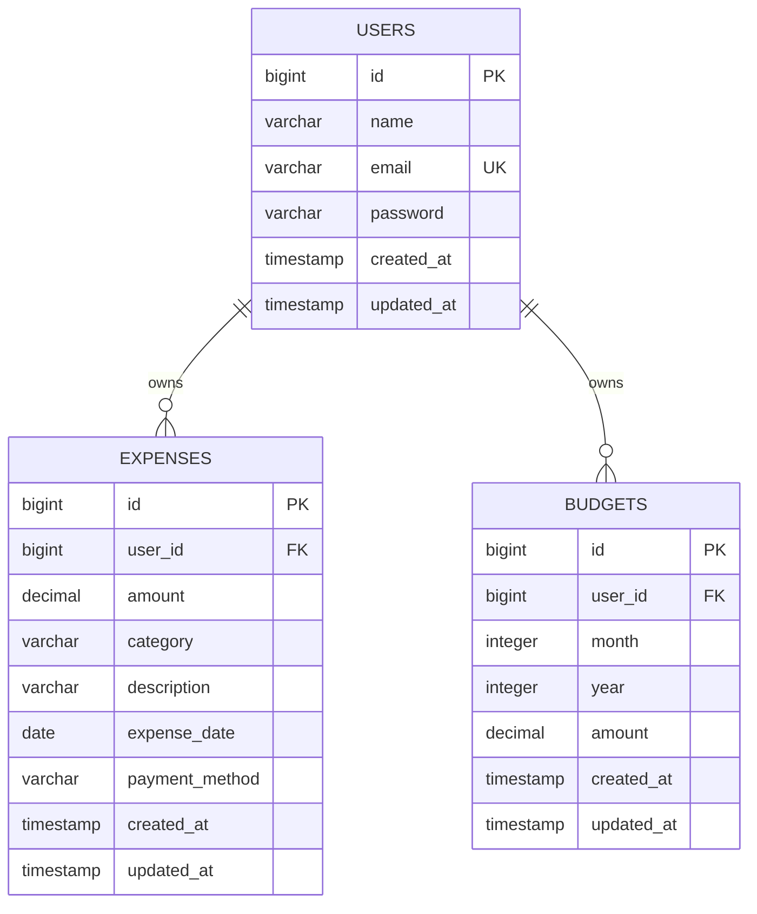

# SmartExpense — Software Requirements Specification (SRS)
## Version 1.0 — MVP

**Document Type:** Software Requirements Specification  
**Product:** SmartExpense — Expense Tracker  
**Version:** 1.0  
**Status:** First Version / MVP  
**Backend:** Java + Spring Boot + Spring Data JPA  
**Database:** PostgreSQL  
**Frontend:** React  
**API Style:** RESTful APIs  
**API Documentation:** OpenAPI / Swagger  
**API Testing:** Postman  

---

# 1. Document Purpose

This document defines the requirements, architecture, data model, API design, folder structure, user flows, validation rules, security requirements, and acceptance criteria for **SmartExpense**, a full-stack personal expense tracking application.

This SRS is the **single source of truth for Version 1.0 development**.

The application will be developed using an AI-assisted/autonomous development workflow through Google Antigravity. The coding agent should use this document as the implementation blueprint and should not invent major requirements without first identifying the impact.

The objective of Version 1.0 is to deliver a stable, functional MVP with:

- User registration and login
- JWT-based authentication
- Expense CRUD
- Expense categories
- Payment methods
- Filtering
- Sorting
- Pagination
- Monthly budget management
- Dashboard
- Category-wise spending analysis
- Monthly spending analysis
- PostgreSQL persistence
- REST APIs
- Swagger/OpenAPI documentation
- Postman testing
- Responsive React frontend
- Validation
- Centralized exception handling
- User data isolation

---

# 2. Product Overview

## 2.1 Product Name

**SmartExpense**

## 2.2 Product Description

SmartExpense is a web-based personal expense management application that allows authenticated users to record, manage, analyze, and monitor their daily spending.

Users can add expenses with categories and payment methods, view their spending history, filter and sort transactions, set a monthly budget, and monitor spending through a dashboard.

The system will use:

```text
React Frontend
       ↓
REST API
       ↓
Spring Boot Backend
       ↓
Spring Data JPA
       ↓
PostgreSQL
```

Authentication will use:

```text
React
   ↓
Login API
   ↓
Spring Security
   ↓
JWT
   ↓
Protected REST APIs
```

---

# 3. Product Vision

The goal of SmartExpense is to provide a simple and reliable way for users to understand where their money is being spent.

The MVP should prioritize:

1. Correctness
2. Security
3. Simple user experience
4. Clean architecture
5. Maintainability
6. Reliable API behavior
7. Real database persistence
8. Easy testing and deployment

The application should be designed so future features can be added without rewriting the entire system.

---

# 4. Goals and Objectives

## 4.1 Primary Goals

- Allow users to securely create accounts.
- Allow users to log in securely.
- Allow users to record expenses.
- Allow users to edit and delete their own expenses.
- Allow users to categorize expenses.
- Allow users to filter and sort expenses.
- Allow users to set monthly budgets.
- Show useful spending summaries.
- Persist all data in PostgreSQL.
- Provide documented REST APIs.
- Provide a responsive React interface.

## 4.2 Secondary Goals

- Keep backend modules loosely coupled.
- Keep frontend and backend responsibilities separate.
- Make API behavior predictable.
- Make the application easy to test using Postman and Swagger.
- Make the codebase suitable for future scaling.

---

# 5. Target Users

Version 1.0 targets individual users who want to track personal expenses.

The application is not intended to be a banking application, accounting system, investment platform, or payment gateway.

---

# 6. Scope

## 6.1 In Scope — Version 1.0

### Authentication

- User registration
- User login
- JWT authentication
- Password hashing
- Protected APIs
- Logout by removing the client-side token/session state

### Expense Management

- Create expense
- View expenses
- View single expense
- Update expense
- Delete expense
- Expense categories
- Payment methods
- Search/filter
- Sorting
- Pagination

### Budget Management

- Create monthly budget
- View budget
- Update budget
- Delete budget
- Budget usage calculation
- Remaining budget calculation
- Budget exceeded status

### Dashboard

- Total expense
- Current month expense
- Today's expense
- Highest expense
- Average daily expense
- Current monthly budget
- Remaining budget
- Budget usage percentage
- Category-wise expense summary
- Monthly expense summary
- Recent expenses

### Technical

- Spring Boot REST API
- Spring Data JPA
- PostgreSQL
- Spring Security
- JWT
- React
- Axios
- Swagger/OpenAPI
- Postman
- Validation
- Global exception handling

---

# 7. Out of Scope — Version 1.0

The following should NOT be implemented in Version 1.0 unless explicitly requested later:

- Bank account integration
- UPI payment processing
- Actual money transfer
- Credit/debit card processing
- Investment tracking
- Cryptocurrency tracking
- Multi-user shared wallets
- Multi-currency conversion
- Receipt OCR
- AI financial advice
- Email notifications
- SMS notifications
- Push notifications
- Recurring expense automation
- PDF/CSV export
- Mobile native application
- Admin dashboard
- Subscription/payment system

These can be considered future enhancements.

---

# 8. Technology Stack

## 8.1 Backend

### Java

Use a modern supported Java version compatible with the selected Spring Boot version.

### Spring Boot

Responsibilities:

- Application configuration
- REST APIs
- Dependency injection
- Web layer
- Security integration
- Validation
- Exception handling

### Spring Data JPA

Responsibilities:

- Entity mapping
- Repository abstraction
- Database persistence
- Query methods
- Pagination
- Sorting
- Database interaction

### Spring Security

Responsibilities:

- Authentication
- Authorization
- Request filtering
- Protected endpoints

### JWT

Responsibilities:

- Stateless authentication
- Secure API access after login

### Maven

Responsibilities:

- Dependency management
- Build
- Test execution
- Packaging

---

# 9. Frontend Technology

## React

Responsibilities:

- User interface
- Routing
- Forms
- Dashboard
- Expense management
- Budget management
- API communication

Recommended supporting technologies:

- React Router
- Axios
- Chart.js / Recharts or equivalent
- CSS or a suitable component/UI system

The frontend must not directly access PostgreSQL.

All database operations must go through backend REST APIs.

---

# 10. Database

## PostgreSQL

PostgreSQL will be the primary persistent database.

The application must not depend on in-memory storage for production functionality.

Database configuration must use environment variables.

Example:

```text
DB_URL
DB_USERNAME
DB_PASSWORD
```

Never commit real database credentials.

---

# 11. High-Level Architecture

```text
                         ┌──────────────────────┐
                         │        USER          │
                         └──────────┬───────────┘
                                    │
                                    ▼
                         ┌──────────────────────┐
                         │    React Frontend    │
                         │                      │
                         │ Pages / Components   │
                         │ Forms / Dashboard     │
                         └──────────┬───────────┘
                                    │
                               HTTP / JSON
                                    │
                                    ▼
                         ┌──────────────────────┐
                         │ Spring Boot REST API │
                         └──────────┬───────────┘
                                    │
                   ┌────────────────┼────────────────┐
                   ▼                ▼                ▼
             Controller         Security          Exception
                   │              / JWT             Handler
                   ▼
               Service
                   │
                   ▼
             Spring Data JPA
                   │
                   ▼
              PostgreSQL
```

---

# 12. Layer Responsibilities

## Controller Layer

Responsible for:

- Receiving HTTP requests
- Validating request DTOs
- Calling services
- Returning HTTP responses

Controllers should NOT contain complex business logic.

## Service Layer

Responsible for:

- Business rules
- Calculations
- Ownership checks
- Transaction boundaries where required
- Calling repositories

## Repository Layer

Responsible for:

- Database access
- Queries
- Pagination
- Sorting
- Aggregation queries

## Entity Layer

Responsible for:

- Database mapping
- Relationships
- Persistent domain model

## DTO Layer

Responsible for:

- API request models
- API response models
- Preventing direct exposure of sensitive entity fields

## Security Layer

Responsible for:

- JWT creation
- JWT validation
- Authentication
- Authorization
- Security context

## Exception Layer

Responsible for:

- Custom exceptions
- Global exception handling
- Standard error responses

---

# 13. Backend Folder Structure

Recommended structure:

```text
backend/
├── pom.xml
├── README.md
├── .env.example
└── src/
    ├── main/
    │   ├── java/
    │   │   └── com/
    │   │       └── smartexpense/
    │   │           ├── SmartExpenseApplication.java
    │   │           │
    │   │           ├── config/
    │   │           │   ├── CorsConfig.java
    │   │           │   └── OpenApiConfig.java
    │   │           │
    │   │           ├── controller/
    │   │           │   ├── AuthController.java
    │   │           │   ├── ExpenseController.java
    │   │           │   ├── BudgetController.java
    │   │           │   └── DashboardController.java
    │   │           │
    │   │           ├── dto/
    │   │           │   ├── auth/
    │   │           │   ├── expense/
    │   │           │   ├── budget/
    │   │           │   └── dashboard/
    │   │           │
    │   │           ├── entity/
    │   │           │   ├── User.java
    │   │           │   ├── Expense.java
    │   │           │   └── Budget.java
    │   │           │
    │   │           ├── repository/
    │   │           │   ├── UserRepository.java
    │   │           │   ├── ExpenseRepository.java
    │   │           │   └── BudgetRepository.java
    │   │           │
    │   │           ├── service/
    │   │           │   ├── AuthService.java
    │   │           │   ├── ExpenseService.java
    │   │           │   ├── BudgetService.java
    │   │           │   └── DashboardService.java
    │   │           │
    │   │           ├── security/
    │   │           │   ├── JwtService.java
    │   │           │   ├── JwtAuthenticationFilter.java
    │   │           │   ├── SecurityConfig.java
    │   │           │   └── CustomUserDetailsService.java
    │   │           │
    │   │           ├── exception/
    │   │           │   ├── GlobalExceptionHandler.java
    │   │           │   ├── ResourceNotFoundException.java
    │   │           │   ├── DuplicateResourceException.java
    │   │           │   └── ErrorResponse.java
    │   │           │
    │   │           └── enums/
    │   │               ├── ExpenseCategory.java
    │   │               └── PaymentMethod.java
    │   │
    │   └── resources/
    │       ├── application.properties
    │       └── application-dev.properties
    │
    └── test/
        └── java/
```

---

# 14. Frontend Folder Structure

```text
frontend/
├── package.json
├── README.md
├── .env.example
└── src/
    ├── api/
    │   ├── axiosClient.js
    │   ├── authApi.js
    │   ├── expenseApi.js
    │   ├── budgetApi.js
    │   └── dashboardApi.js
    │
    ├── assets/
    │
    ├── components/
    │   ├── Navbar.jsx
    │   ├── Sidebar.jsx
    │   ├── Loading.jsx
    │   ├── ErrorMessage.jsx
    │   ├── ConfirmDialog.jsx
    │   ├── ExpenseForm.jsx
    │   ├── ExpenseTable.jsx
    │   ├── BudgetCard.jsx
    │   └── SummaryCard.jsx
    │
    ├── context/
    │   └── AuthContext.jsx
    │
    ├── hooks/
    │
    ├── layouts/
    │   └── DashboardLayout.jsx
    │
    ├── pages/
    │   ├── Login.jsx
    │   ├── Register.jsx
    │   ├── Dashboard.jsx
    │   ├── Expenses.jsx
    │   ├── AddExpense.jsx
    │   ├── EditExpense.jsx
    │   └── Budget.jsx
    │
    ├── routes/
    │   ├── AppRoutes.jsx
    │   └── ProtectedRoute.jsx
    │
    ├── utils/
    │   ├── currency.js
    │   ├── date.js
    │   └── validation.js
    │
    ├── App.jsx
    ├── main.jsx
    └── index.css
```

---

# 15. Database Design

Version 1.0 requires three primary tables:

```text
users
expenses
budgets
```

---

# 16. Users Table

Table:

```text
users
```

Columns:

| Column | Type | Constraints |
|---|---|---|
| id | BIGSERIAL / BIGINT | Primary Key |
| name | VARCHAR(100) | NOT NULL |
| email | VARCHAR(255) | NOT NULL, UNIQUE |
| password | VARCHAR(255) | NOT NULL |
| created_at | TIMESTAMP | NOT NULL |
| updated_at | TIMESTAMP | NOT NULL |

Rules:

- Email must be unique.
- Email should be normalized.
- Password must contain a BCrypt hash, never plain text.
- Password must never appear in API response DTOs.

---

# 17. Expenses Table

Table:

```text
expenses
```

Columns:

| Column | Type | Constraints |
|---|---|---|
| id | BIGSERIAL / BIGINT | Primary Key |
| user_id | BIGINT | NOT NULL, FK users.id |
| amount | NUMERIC(12,2) | NOT NULL |
| category | VARCHAR(50) | NOT NULL |
| description | VARCHAR(500) | NULL |
| expense_date | DATE | NOT NULL |
| payment_method | VARCHAR(50) | NOT NULL |
| created_at | TIMESTAMP | NOT NULL |
| updated_at | TIMESTAMP | NOT NULL |

Use exact numeric/decimal storage for monetary values.

Do not use floating-point types for money.

Recommended indexes:

```text
expenses(user_id)
expenses(user_id, expense_date)
expenses(user_id, category)
```

---

# 18. Budgets Table

Table:

```text
budgets
```

Columns:

| Column | Type | Constraints |
|---|---|---|
| id | BIGSERIAL / BIGINT | Primary Key |
| user_id | BIGINT | NOT NULL, FK users.id |
| month | INTEGER | NOT NULL |
| year | INTEGER | NOT NULL |
| amount | NUMERIC(12,2) | NOT NULL |
| created_at | TIMESTAMP | NOT NULL |
| updated_at | TIMESTAMP | NOT NULL |

Recommended constraint:

```text
UNIQUE(user_id, month, year)
```

This prevents multiple budgets for the same user and month.

---

# 19. Entity Relationship



---

# 20. Expense Categories

Version 1.0:

```text
FOOD
TRAVEL
SHOPPING
BILLS
ENTERTAINMENT
HEALTH
EDUCATION
RENT
GROCERIES
OTHER
```

The backend should preferably represent these as a Java enum.

The API may expose human-readable values such as:

```text
Food
Travel
Shopping
```

The implementation should maintain one consistent representation between frontend, backend, and database.

---

# 21. Payment Methods

Version 1.0:

```text
CASH
UPI
CREDIT_CARD
DEBIT_CARD
BANK_TRANSFER
OTHER
```

Use a Java enum or controlled validation mechanism.

---

# 22. Authentication API

## 22.1 Register

```http
POST /api/auth/register
```

Request:

```json
{
  "name": "Omkar",
  "email": "omkar@example.com",
  "password": "SecurePassword123"
}
```

Success:

```http
201 Created
```

Example response:

```json
{
  "message": "User registered successfully",
  "user": {
    "id": 1,
    "name": "Omkar",
    "email": "omkar@example.com"
  }
}
```

Do not return password.

---

# 23. Login API

```http
POST /api/auth/login
```

Request:

```json
{
  "email": "omkar@example.com",
  "password": "SecurePassword123"
}
```

Success:

```http
200 OK
```

Example:

```json
{
  "token": "<JWT_TOKEN>",
  "tokenType": "Bearer",
  "user": {
    "id": 1,
    "name": "Omkar",
    "email": "omkar@example.com"
  }
}
```

---

# 24. JWT Authentication Flow

```text
User
  ↓
POST /api/auth/login
  ↓
Spring Security verifies credentials
  ↓
Password checked using BCrypt
  ↓
JWT generated
  ↓
JWT returned to React
  ↓
React stores authentication state
  ↓
React sends:
Authorization: Bearer <token>
  ↓
JWT Filter validates token
  ↓
SecurityContext identifies user
  ↓
Protected Controller
```

The backend must derive the authenticated user from the security context.

Do NOT trust a `userId` supplied by the frontend for ownership decisions.

---

# 25. Expense APIs

## Create Expense

```http
POST /api/expenses
Authorization: Bearer <JWT>
```

Request:

```json
{
  "amount": 450.00,
  "category": "FOOD",
  "description": "Dinner",
  "expenseDate": "2026-08-20",
  "paymentMethod": "UPI"
}
```

Response:

```http
201 Created
```

---

## Get Expenses

```http
GET /api/expenses
Authorization: Bearer <JWT>
```

Supported query parameters:

```text
page
size
sort
category
paymentMethod
startDate
endDate
minAmount
maxAmount
```

Example:

```http
GET /api/expenses?page=0&size=10&sort=expenseDate,desc&category=FOOD
```

---

## Get Expense By ID

```http
GET /api/expenses/{id}
Authorization: Bearer <JWT>
```

The expense must belong to the authenticated user.

---

## Update Expense

```http
PUT /api/expenses/{id}
Authorization: Bearer <JWT>
```

Request:

```json
{
  "amount": 500.00,
  "category": "FOOD",
  "description": "Dinner and dessert",
  "expenseDate": "2026-08-20",
  "paymentMethod": "UPI"
}
```

---

## Delete Expense

```http
DELETE /api/expenses/{id}
Authorization: Bearer <JWT>
```

Success:

```http
204 No Content
```

---

# 26. Expense Response

Recommended response:

```json
{
  "id": 10,
  "amount": 450.00,
  "category": "FOOD",
  "description": "Dinner",
  "expenseDate": "2026-08-20",
  "paymentMethod": "UPI",
  "createdAt": "2026-08-20T14:00:00",
  "updatedAt": "2026-08-20T14:00:00"
}
```

Do not expose internal password or unnecessary user information.

---

# 27. Pagination Response

Recommended structure:

```json
{
  "content": [],
  "page": 0,
  "size": 10,
  "totalElements": 25,
  "totalPages": 3,
  "last": false
}
```

---

# 28. Expense Filtering

Supported filters:

```text
category
paymentMethod
startDate
endDate
minAmount
maxAmount
```

Examples:

```http
GET /api/expenses?category=FOOD
```

```http
GET /api/expenses?paymentMethod=UPI
```

```http
GET /api/expenses?startDate=2026-08-01&endDate=2026-08-20
```

```http
GET /api/expenses?minAmount=100&maxAmount=1000
```

Multiple filters should be combinable.

---

# 29. Sorting

Support:

```text
expenseDate,asc
expenseDate,desc
amount,asc
amount,desc
createdAt,desc
```

Default:

```text
expenseDate,desc
```

---

# 30. Budget APIs

## Create Budget

```http
POST /api/budgets
Authorization: Bearer <JWT>
```

Request:

```json
{
  "month": 8,
  "year": 2026,
  "amount": 20000.00
}
```

---

## Get Budgets

```http
GET /api/budgets
Authorization: Bearer <JWT>
```

---

## Get Budget By ID

```http
GET /api/budgets/{id}
Authorization: Bearer <JWT>
```

---

## Update Budget

```http
PUT /api/budgets/{id}
Authorization: Bearer <JWT>
```

---

## Delete Budget

```http
DELETE /api/budgets/{id}
Authorization: Bearer <JWT>
```

---

# 31. Budget Calculation

For a selected month:

```text
remainingBudget = budgetAmount - totalExpense
```

Budget usage:

```text
usagePercentage =
(totalExpense / budgetAmount) * 100
```

If:

```text
totalExpense > budgetAmount
```

then:

```text
budgetExceeded = true
```

Avoid division by zero.

---

# 32. Dashboard APIs

## Dashboard Summary

```http
GET /api/dashboard/summary
Authorization: Bearer <JWT>
```

Example:

```json
{
  "totalExpense": 24500.00,
  "currentMonthExpense": 8250.00,
  "todayExpense": 450.00,
  "highestExpense": 3000.00,
  "averageDailyExpense": 412.50,
  "monthlyBudget": 20000.00,
  "remainingBudget": 11750.00,
  "budgetUsagePercentage": 41.25,
  "budgetExceeded": false
}
```

All values must be calculated from PostgreSQL data.

---

# 33. Category Summary API

```http
GET /api/dashboard/category-summary
Authorization: Bearer <JWT>
```

Example:

```json
[
  {
    "category": "FOOD",
    "total": 5000.00
  },
  {
    "category": "TRAVEL",
    "total": 3500.00
  }
]
```

---

# 34. Monthly Summary API

```http
GET /api/dashboard/monthly-summary
Authorization: Bearer <JWT>
```

Example:

```json
[
  {
    "month": "2026-06",
    "total": 18000.00
  },
  {
    "month": "2026-07",
    "total": 21000.00
  },
  {
    "month": "2026-08",
    "total": 8250.00
  }
]
```

---

# 35. Recent Expenses

The dashboard should show the latest expenses.

Recommended:

```http
GET /api/expenses?page=0&size=5&sort=createdAt,desc
```

The frontend can use the existing expense API rather than creating unnecessary duplicate endpoints.

---

# 36. Validation Requirements

## User

| Field | Rule |
|---|---|
| name | Required, reasonable length |
| email | Required, valid email |
| password | Required, minimum security length |

## Expense

| Field | Rule |
|---|---|
| amount | Required, greater than 0 |
| category | Required, valid category |
| description | Optional, maximum length |
| expenseDate | Required, valid date |
| paymentMethod | Required, valid method |

## Budget

| Field | Rule |
|---|---|
| month | 1–12 |
| year | Valid year |
| amount | Greater than 0 |

Validation must exist at the API boundary using Jakarta Bean Validation where appropriate.

Business validation must also exist in the service layer where necessary.

---

# 37. Standard Error Response

All API errors should follow a consistent format.

Example:

```json
{
  "timestamp": "2026-08-20T14:00:00",
  "status": 400,
  "message": "Amount must be greater than zero",
  "path": "/api/expenses"
}
```

For validation errors, an optional field-error map may be included:

```json
{
  "timestamp": "2026-08-20T14:00:00",
  "status": 400,
  "message": "Validation failed",
  "errors": {
    "amount": "Amount must be greater than zero",
    "category": "Category is required"
  },
  "path": "/api/expenses"
}
```

---

# 38. HTTP Status Codes

| Status | Usage |
|---|---|
| 200 | Successful GET/PUT or successful operation |
| 201 | Resource created |
| 204 | Resource deleted successfully |
| 400 | Invalid request / validation error |
| 401 | Missing or invalid authentication |
| 403 | Authenticated but not authorized |
| 404 | Resource not found |
| 409 | Duplicate/conflicting resource |
| 500 | Unexpected server error |

---

# 39. Security Requirements

## Password Security

Use BCrypt.

Never store:

```text
password123
```

Store only the BCrypt hash.

## JWT

JWT secret must come from environment/configuration.

Never hardcode the production secret.

## Authorization

Every protected request must identify the authenticated user.

A user must only access:

- their own expenses
- their own budgets
- their own dashboard information

Example attack that must fail:

```text
User A JWT
+
GET /api/expenses/{User B expense ID}
```

The request must not return User B's data.

## CORS

Configure CORS for the React frontend origin.

Do not use unrestricted wildcard CORS in production configuration.

---

# 40. Frontend Pages

## 40.1 Login

Fields:

- Email
- Password

Features:

- Login
- Validation
- Error message
- Loading state
- Link to registration

---

# 41. Registration

Fields:

- Name
- Email
- Password
- Confirm Password

Features:

- Validation
- Password confirmation
- Duplicate email handling
- Loading state
- Success/error feedback

---

# 42. Dashboard UI

Dashboard should include:

```text
┌──────────────────────────────────────────┐
│              SmartExpense                │
├───────────┬───────────┬──────────────────┤
│ Total     │ This Month│ Today's Expense  │
│ Expense   │ Expense   │                  │
├───────────┴───────────┴──────────────────┤
│                                          │
│ Category Spending Chart                  │
│                                          │
├──────────────────────────────────────────┤
│ Monthly Spending Chart                   │
│                                          │
├──────────────────────┬───────────────────┤
│ Budget Progress      │ Recent Expenses    │
└──────────────────────┴───────────────────┘
```

The exact UI can be improved by the implementation agent, but the functionality must remain consistent with this SRS.

---

# 43. Expense Management UI

The expense page must support:

- View expenses
- Add
- Edit
- Delete
- Filter
- Sort
- Pagination
- Loading state
- Empty state
- Error state

Expense table columns:

```text
Date
Category
Description
Payment Method
Amount
Actions
```

---

# 44. Expense Form

Fields:

```text
Amount
Category
Description
Expense Date
Payment Method
```

Use frontend validation before API submission.

Backend validation remains mandatory even if frontend validation exists.

---

# 45. Budget UI

Display:

```text
Monthly Budget
Total Spent
Remaining
Usage %
Status
```

Status examples:

```text
Within Budget
Near Budget Limit
Budget Exceeded
```

The backend remains the source of truth for calculations.

---

# 46. API Client Architecture

Use Axios or equivalent centralized HTTP client.

Recommended:

```text
api/
├── axiosClient.js
├── authApi.js
├── expenseApi.js
├── budgetApi.js
└── dashboardApi.js
```

The frontend should not scatter raw Axios configuration throughout components.

JWT should be attached to protected requests through a centralized mechanism/interceptor.

Handle:

- 401 responses
- expired tokens
- network errors
- API validation errors

---

# 47. React Routing

Required routes:

```text
/login
/register
/dashboard
/expenses
/expenses/new
/expenses/:id/edit
/budget
```

Protected routes:

```text
/dashboard
/expenses
/expenses/new
/expenses/:id/edit
/budget
```

Unauthenticated users should be redirected to `/login`.

---

# 48. Frontend State

Authentication state should be centrally managed.

Possible approach:

```text
AuthContext
```

Store only the minimum authentication information required by the client.

Do not expose sensitive backend information unnecessarily.

---

# 49. UI States

Every important asynchronous operation must have:

## Loading State

Example:

```text
Loading expenses...
```

## Empty State

Example:

```text
No expenses found.
Add your first expense.
```

## Error State

Example:

```text
Unable to load expenses. Please try again.
```

## Success State

Example:

```text
Expense added successfully.
```

---

# 50. Currency and Date Rules

Currency:

```text
INR / ₹
```

Monetary values must be formatted consistently.

Example:

```text
₹1,500.00
```

Dates should use a consistent API format:

```text
YYYY-MM-DD
```

Timestamps should use a standard ISO-compatible format.

---

# 51. Swagger / OpenAPI

Swagger must document:

- Authentication APIs
- Expense APIs
- Budget APIs
- Dashboard APIs
- Request schemas
- Response schemas
- Validation errors
- HTTP status codes
- JWT Bearer authentication

Swagger should support:

```text
Authorize
    ↓
Bearer <JWT>
    ↓
Test protected APIs
```

Expected local URL should be documented according to the selected OpenAPI/Springdoc configuration.

---

# 52. Postman Collection

Collection:

```text
SmartExpense API
│
├── Authentication
│   ├── Register
│   └── Login
│
├── Expenses
│   ├── Create Expense
│   ├── Get Expenses
│   ├── Get Expense By ID
│   ├── Update Expense
│   └── Delete Expense
│
├── Dashboard
│   ├── Summary
│   ├── Category Summary
│   └── Monthly Summary
│
└── Budget
    ├── Create Budget
    ├── Get Budgets
    ├── Get Budget By ID
    ├── Update Budget
    └── Delete Budget
```

Environment variables:

```text
baseUrl
token
expenseId
budgetId
```

Login should make it easy to capture/store the JWT token for subsequent requests.

---

# 53. Testing Requirements

## Backend Unit Tests

Test:

- Registration service
- Login service
- Expense service
- Budget service
- Dashboard calculations
- Validation/business rules

## Integration Tests

Test:

- API + service + repository
- PostgreSQL integration where configured
- Authentication flow
- Protected endpoints

## API Tests

Test using Postman:

- Success cases
- Invalid requests
- Unauthorized requests
- Not found
- Duplicate email
- Invalid JWT
- User isolation

## Frontend Testing

At minimum verify manually or through suitable tests:

- Login
- Registration
- Dashboard loading
- Add expense
- Edit expense
- Delete expense
- Filters
- Pagination
- Budget operations
- Error handling

---

# 54. User Data Isolation

This is a mandatory security requirement.

Example:

```text
User A
  ├── Expense 1
  └── Expense 2

User B
  ├── Expense 3
  └── Expense 4
```

User A must never receive Expense 3 or Expense 4.

Repositories/services should query data in the context of the authenticated user.

Do not implement insecure logic such as:

```text
findExpenseById(id)
```

without checking ownership.

Prefer logic equivalent to:

```text
findExpenseByIdAndUserId(id, authenticatedUserId)
```

where appropriate.

---

# 55. Database Query Requirements

Use Spring Data JPA.

Use:

- repository query methods
- JPQL
- specifications
- projections
- aggregation queries

where appropriate.

Avoid loading the entire expense table into Java merely to calculate dashboard totals.

Dashboard aggregation should be performed efficiently at the database/query level when practical.

---

# 56. Transaction Requirements

Use transaction boundaries appropriately.

Examples:

- Registration
- Expense creation/update
- Budget creation/update

Avoid unnecessary long-running transactions.

---

# 57. Configuration

Use environment-specific configuration.

Recommended conceptual setup:

```text
application.properties
application-dev.properties
application-prod.properties
```

Do not commit real secrets.

Example placeholders:

```properties
spring.datasource.url=${DB_URL}
spring.datasource.username=${DB_USERNAME}
spring.datasource.password=${DB_PASSWORD}

jwt.secret=${JWT_SECRET}
jwt.expiration=${JWT_EXPIRATION}
```

The exact configuration can vary according to implementation, but secrets must remain externalized.

---

# 58. Logging

Backend should use appropriate application logging.

Log useful operational information such as:

- application startup
- important errors
- unexpected exceptions

Do NOT log:

- passwords
- JWT tokens
- database passwords
- sensitive user data unnecessarily

---

# 59. Product Roadmap

## Phase 1 — Foundation

Deliver:

- Backend project
- React project
- PostgreSQL connection
- Maven configuration
- Frontend configuration
- Environment configuration

Completion criteria:

- Backend starts
- Frontend starts
- PostgreSQL connection is verified

---

## Phase 2 — Authentication

Deliver:

- User entity
- Registration
- Login
- BCrypt
- JWT
- Spring Security
- Protected routes

Completion criteria:

- Register works
- Login works
- JWT works
- Protected API rejects unauthenticated requests

---

## Phase 3 — Expense Module

Deliver:

- Expense entity
- CRUD APIs
- Validation
- Filtering
- Sorting
- Pagination
- User ownership

Completion criteria:

- Complete expense lifecycle works
- Data persists in PostgreSQL
- User isolation works

---

## Phase 4 — Budget Module

Deliver:

- Budget entity
- CRUD APIs
- Monthly uniqueness
- Budget calculations

Completion criteria:

- User can manage monthly budget
- Spending and remaining amount are correct

---

## Phase 5 — Dashboard

Deliver:

- Summary API
- Category summary
- Monthly summary
- Budget status
- Recent expenses

Completion criteria:

- Dashboard values match database data

---

## Phase 6 — React Frontend

Deliver:

- Authentication pages
- Dashboard
- Expense pages
- Budget page
- Routing
- API integration
- Loading/error/empty states

Completion criteria:

- Complete user flow works from browser

---

## Phase 7 — API Documentation and Testing

Deliver:

- Swagger
- OpenAPI schemas
- Postman collection
- Backend tests
- API tests

Completion criteria:

- APIs can be demonstrated independently through Swagger/Postman

---

## Phase 8 — Stabilization

Perform:

- Build verification
- Bug fixing
- Security checks
- API verification
- Frontend verification
- Database verification
- End-to-end flow

Completion criteria:

- No known critical errors
- Backend builds successfully
- Frontend builds successfully

---

# 60. Complete End-to-End User Flow

```text
Open SmartExpense
        ↓
Register
        ↓
Login
        ↓
Receive JWT
        ↓
Dashboard
        ↓
Create Monthly Budget
        ↓
Add Expense
        ↓
Expense saved in PostgreSQL
        ↓
Dashboard recalculates
        ↓
View category analysis
        ↓
View monthly analysis
        ↓
Filter expenses
        ↓
Edit expense
        ↓
Delete expense
```

---

# 61. Acceptance Criteria

Version 1.0 is accepted only when all of the following are true:

## Authentication

- [ ] User can register.
- [ ] Duplicate email is rejected.
- [ ] User can login.
- [ ] Invalid credentials are rejected.
- [ ] Password is hashed.
- [ ] JWT is generated.
- [ ] Protected endpoints reject missing/invalid JWT.

## Expenses

- [ ] User can create expense.
- [ ] User can view own expenses.
- [ ] User can view own expense by ID.
- [ ] User can update own expense.
- [ ] User can delete own expense.
- [ ] Invalid expense data is rejected.
- [ ] Filtering works.
- [ ] Sorting works.
- [ ] Pagination works.
- [ ] User cannot access another user's expense.

## Budget

- [ ] User can create monthly budget.
- [ ] Duplicate monthly budget is rejected.
- [ ] User can view budget.
- [ ] User can update budget.
- [ ] User can delete budget.
- [ ] Remaining budget is correct.
- [ ] Budget percentage is correct.
- [ ] Budget exceeded state is correct.

## Dashboard

- [ ] Total expense is correct.
- [ ] Current month expense is correct.
- [ ] Today's expense is correct.
- [ ] Highest expense is correct.
- [ ] Average daily expense is correct.
- [ ] Category summary is correct.
- [ ] Monthly summary is correct.
- [ ] Budget information is correct.

## Frontend

- [ ] Registration works.
- [ ] Login works.
- [ ] Protected routing works.
- [ ] Dashboard works.
- [ ] Expense CRUD works.
- [ ] Budget CRUD works.
- [ ] Charts display real API data.
- [ ] Loading states work.
- [ ] Error states work.
- [ ] Empty states work.
- [ ] Responsive layout works.

## Technical

- [ ] PostgreSQL persistence works.
- [ ] Spring Data JPA works.
- [ ] Swagger works.
- [ ] Postman requests work.
- [ ] Backend tests pass.
- [ ] Frontend builds successfully.
- [ ] Backend builds successfully.
- [ ] No real secrets are committed.
- [ ] No critical runtime errors remain.

---

# 62. Definition of Done

The MVP is complete when the following complete chain works:

```text
React
  ↓
REST API
  ↓
Spring Security / JWT
  ↓
Controller
  ↓
Service
  ↓
Spring Data JPA
  ↓
PostgreSQL
  ↓
Response
  ↓
React Dashboard
```

The application must use real data throughout this flow.

No critical feature should depend on hardcoded mock data.

---

# 63. Future Version Ideas

These are intentionally excluded from Version 1.0.

## Version 2

Possible additions:

- Recurring expenses
- Expense export
- PDF reports
- CSV export
- Budget alerts
- Email notifications
- Advanced analytics
- Custom categories

## Version 3

Possible additions:

- Receipt image upload
- OCR
- AI spending insights
- Financial recommendations
- Multi-currency
- Shared family wallets
- Mobile application

These should be planned only after Version 1.0 is stable.

---

# 64. AI Autonomous Development Requirements

Google Antigravity should use this SRS as the implementation source of truth.

The autonomous development workflow should follow:

```text
Read SRS
   ↓
Create implementation plan
   ↓
Create project structure
   ↓
Implement backend foundation
   ↓
Implement database entities
   ↓
Implement authentication
   ↓
Implement expense module
   ↓
Implement budget module
   ↓
Implement dashboard APIs
   ↓
Implement React frontend
   ↓
Integrate frontend + backend
   ↓
Configure Swagger
   ↓
Test APIs
   ↓
Run backend tests
   ↓
Build backend
   ↓
Build frontend
   ↓
Identify errors
   ↓
Fix root causes
   ↓
Re-test
   ↓
Final verification
```

The coding agent must not mark a feature as complete merely because source files were generated.

A feature is complete only after its implementation is compiled/built and verified.

---

# 65. AI Agent Development Rules

The implementation agent must:

1. Read this SRS before coding.
2. Follow the specified technology stack.
3. Avoid unnecessary technologies.
4. Avoid overengineering Version 1.0.
5. Keep controllers thin.
6. Keep business logic in services.
7. Use repositories for persistence.
8. Use DTOs for API boundaries.
9. Validate all external input.
10. Protect all private APIs.
11. Enforce user ownership.
12. Never expose passwords.
13. Never hardcode secrets.
14. Use PostgreSQL as the persistent database.
15. Use Spring Data JPA for persistence.
16. Use React for the frontend.
17. Use REST APIs between frontend and backend.
18. Document APIs using Swagger/OpenAPI.
19. Verify APIs using Postman.
20. Build and test after implementation.
21. Fix compilation/runtime errors instead of hiding them.
22. Avoid creating duplicate functionality.
23. Avoid unnecessary endpoints.
24. Keep the MVP scope controlled.

---

# 66. Final Technical Summary

```text
PRODUCT
SmartExpense

BACKEND
Java JDK 21
Spring Boot 3.x
Spring Data JPA
Spring Security
JWT
Maven

DATABASE
PostgreSQL

FRONTEND
React
React Router
Axios
Chart Library

API
REST
JSON
OpenAPI / Swagger

TESTING
JUnit / Spring Boot Test
Postman

CORE MODULES
Authentication
Expenses
Budget
Dashboard

DATABASE TABLES
users
expenses
budgets
```

---

# 67. Version 1.0 Final Scope

The first version must remain focused on the following:

```text
                    SmartExpense V1
                         │
        ┌────────────────┼────────────────┐
        │                │                │
 Authentication      Expenses          Budget
        │                │                │
 Register            Create           Create
 Login               Read             Read
 JWT                 Update           Update
 Security            Delete           Delete
                     Filter
                     Sort
                     Pagination
        │                │                │
        └────────────────┼────────────────┘
                         │
                     Dashboard
                         │
             ┌───────────┼───────────┐
             │           │           │
          Summary     Category     Monthly
                       Analysis     Analysis
                         │
                         ▼
                    PostgreSQL
```

**This document defines the Version 1.0 MVP and should be treated as the baseline specification for implementation.**


# 101. Developer Machine Prerequisites

The following tools should be installed before starting Version 1.0 development.

## 101.1 Mandatory

| Software | Required | Purpose |
|---|---|---|
| JDK 21 | YES | Compile and run Spring Boot backend |
| PostgreSQL 17.11 | YES | Application database |
| Node.js LTS | YES | Run/build React frontend and npm tooling |
| npm | YES | React dependency management |
| Google Antigravity | YES | Primary autonomous development environment |
| Git | Strongly recommended | Source control and rollback |

Spring Boot's current installation documentation requires Java SDK 17 or higher; JDK 21 therefore satisfies the Java requirement. Spring Boot also supports Maven 3.6.3+; however, this project should include Maven Wrapper so a separate global Maven installation is optional. citeturn0search3turn0search4

## 101.2 Strongly Recommended

### pgAdmin 4

Install pgAdmin 4 for graphical PostgreSQL administration. It is useful for:

- Creating/checking the database
- Viewing tables
- Running SQL
- Inspecting constraints and indexes
- Checking Flyway-created schema
- Debugging data

pgAdmin is a graphical management tool for PostgreSQL. citeturn0search0

### Postman

Install Postman for manual REST API testing.

Use it to test:

- Register
- Login
- JWT authentication
- Expense CRUD
- Filtering
- Pagination
- Budget APIs
- Dashboard APIs
- Error cases

### VS Code or another IDE

Google Antigravity will be the primary development environment. A separate IDE is optional, but VS Code/IntelliJ IDEA can be useful for manual inspection and debugging.

### Git

Git should be installed and the project should be initialized as a Git repository. Commit after each stable milestone.

## 101.3 Do NOT install separately unless required

The following do not need separate installation merely for this project:

- PostgreSQL JDBC driver — Maven downloads it as a project dependency. pgJDBC is the Java driver used to connect Java applications to PostgreSQL. citeturn0search12
- Spring Boot itself — it is managed through the Maven project.
- Spring Data JPA — Maven dependency.
- Spring Security — Maven dependency.
- Flyway — Maven dependency.
- Swagger/OpenAPI library — Maven dependency.
- JWT library — Maven dependency.
- React — created through the Node/npm toolchain.

## 101.4 Optional tools

These are not required for V1:

- Docker Desktop
- DBeaver
- IntelliJ IDEA
- GitHub Desktop
- Redis
- Kubernetes

Do not introduce Docker, Redis, Kubernetes or other infrastructure into V1 unless there is a concrete requirement.

# 102. Recommended Local Software Architecture

The development machine should provide:

```text
Google Antigravity
       │
       ├── Java JDK 21
       │      └── Spring Boot 3.x + Maven Wrapper
       │
       ├── Node.js LTS
       │      └── React + npm
       │
       ├── PostgreSQL 17.11
       │      └── pgAdmin 4 (optional GUI)
       │
       ├── Git
       │
       └── Postman
```

# 103. Recommended Version Verification

Before asking Antigravity to build the project, verify:

```bash
java -version

node -v
npm -v

git --version

psql --version
```

If Maven is installed globally, also verify:

```bash
mvn -version
```

After the Spring Boot project is generated, prefer:

```bash
./mvnw -version
```

On Windows:

```powershell
.\mvnw.cmd -version
```

The project must report Java 21.

# 104. PostgreSQL Local Setup Requirements

Install PostgreSQL 17.11 and create a dedicated development database, for example:

```text
Database: smartexpense
Username: postgres
Port: 5432
```

The actual username/password must be kept outside source control.

Example environment variables:

```text
DB_URL=jdbc:postgresql://localhost:5432/smartexpense
DB_USERNAME=postgres
DB_PASSWORD=<local-password>
JWT_SECRET=<local-secret>
JWT_EXPIRATION=<configured-duration>
FRONTEND_URL=http://localhost:5173
```

# 105. Flyway + PostgreSQL Requirement

Flyway is the sole owner of application schema creation and migration. Spring Boot documentation recommends using a higher-level migration tool such as Flyway alone rather than mixing it with `schema.sql`/`data.sql`. For PostgreSQL, the Flyway PostgreSQL database module may also be required depending on the selected Flyway version. citeturn0search11

Therefore the application must use:

```properties
spring.jpa.hibernate.ddl-auto=validate
spring.flyway.enabled=true
```

The implementation agent must choose compatible Flyway dependencies for the selected Spring Boot release.

# 106. Exact V1 Technology Baseline

The implementation baseline is:

```text
Language              : Java JDK 21
Backend Framework     : Spring Boot 3.x
ORM                   : Spring Data JPA / Hibernate
Security              : Spring Security + JWT
Database              : PostgreSQL 17.11
Migration              : Flyway
Frontend              : React
Frontend Build Tool   : Vite recommended
HTTP Client           : Axios recommended
API Style             : REST + JSON
API Documentation     : OpenAPI / Swagger
API Testing           : Postman
Build Tool            : Maven Wrapper
Source Control        : Git
Primary IDE/Agent     : Google Antigravity
```

# 107. Important Compatibility Rule

The implementation agent must verify dependency compatibility before selecting exact library versions. Do not blindly copy the newest version of every dependency.

JDK 21 is fixed for this project. PostgreSQL 17.11 is fixed for the local development database. Spring Boot, Flyway, pgJDBC, JWT and frontend package versions should be selected as a mutually compatible set.

# 108. Pre-Development Checklist

Before implementation starts:

- [ ] JDK 21 installed
- [ ] `java -version` shows Java 21
- [ ] PostgreSQL 17.11 installed
- [ ] PostgreSQL service is running
- [ ] `psql --version` verified
- [ ] `smartexpense` database created
- [ ] Node.js LTS installed
- [ ] npm verified
- [ ] Git installed
- [ ] Postman installed
- [ ] pgAdmin 4 installed/recommended
- [ ] Google Antigravity installed/configured
- [ ] Project folder created
- [ ] `.gitignore` created
- [ ] `.env.example` planned

# 109. First Antigravity Execution Goal

The first autonomous development task should NOT attempt to build the entire product at once.

The agent should first create and verify the foundation:

```text
1. Create project structure
2. Configure JDK 21
3. Configure Spring Boot 3.x
4. Configure Maven Wrapper
5. Configure PostgreSQL 17.11
6. Add Flyway
7. Create V1 migration
8. Start backend
9. Verify database connection
10. Start React
11. Verify frontend
12. Commit stable foundation
```

Only after this foundation is working should the agent proceed to authentication and the remaining V1 modules.

# 110. Final V1 Environment

The complete Version 1.0 environment is:

```text
                    SMARTEXPENSE V1

       ┌─────────────────────────────────┐
       │       Google Antigravity        │
       └────────────────┬────────────────┘
                        │
             ┌──────────┴──────────┐
             │                     │
             ▼                     ▼
      React + Vite            Spring Boot 3.x
      Node.js + npm              JDK 21
             │                     │
             │              Spring Data JPA
             │                     │
             │              Spring Security
             │                     │
             │                   Flyway
             │                     │
             └──────── REST ───────┤
                                   ▼
                           PostgreSQL 17.11
                                   │
                              pgAdmin 4

       Supporting Tools:
       Git + Postman
```

This environment is sufficient for the complete SmartExpense Version 1.0 MVP.
